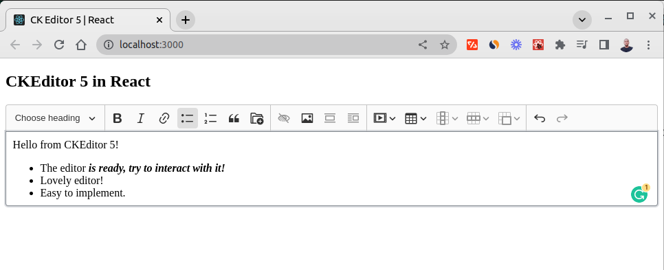
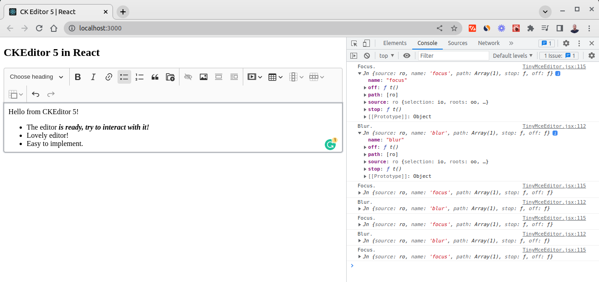

# CK Editor 5

## Technologies

- React

## Installation

```code
# clone the repo
git clone https://github.com/hesbon-osoro/ck-editor-react.git

# Go to directory
cd ck-editor-react && yarn

# start the app
yarn start
```

View the started app at [`localhost:300`](http://localhost:3000/)

## Demo

[](https://ck-editor-react.netlify.app/)

Inspect the browser to see events fired from the app
[](https://ck-editor-react.netlify.app/)

Star the project!
Follow for Follow Back!
